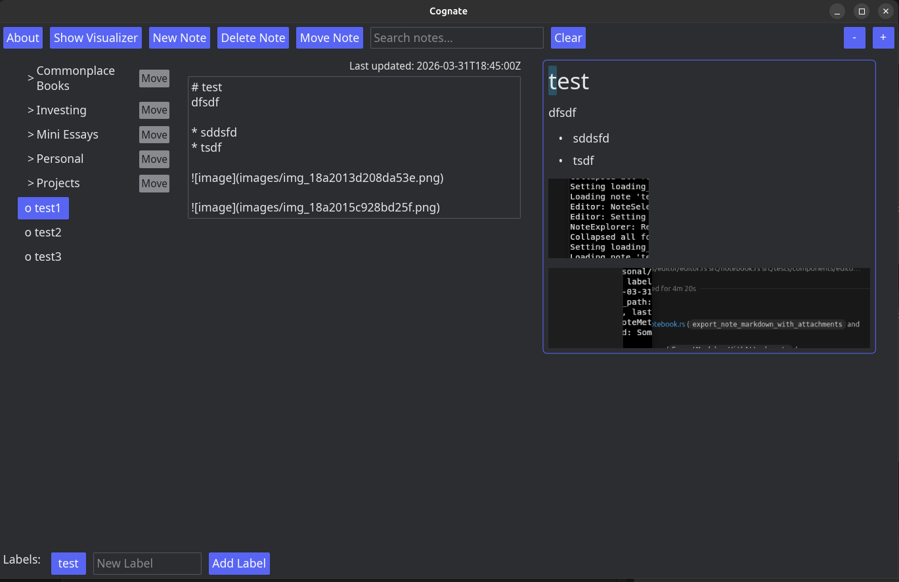
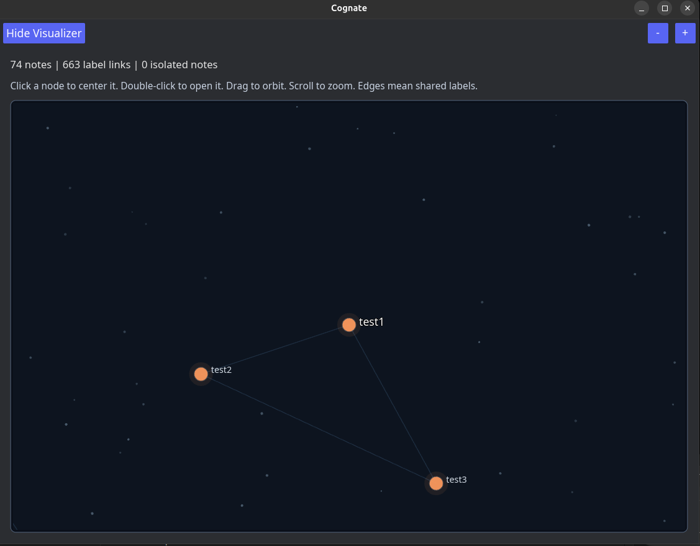

# Development Guide

This guide is the fastest way to onboard to Cognate as a contributor.

## Prerequisites

- Rust toolchain installed via `rustup`
- `cargo` available in `PATH`
- Optional: `make` for convenience targets

## Local Setup

1. Clone the repository.
2. Ensure `config.json` points to a valid notebook directory.
3. Run the app:

```bash
cargo run
```

## UI Snapshots





## Daily Commands

- `cargo test`: run all tests
- `cargo clippy --all-targets -- -D warnings`: lint with warnings as errors
- `cargo fmt --all -- --check`: verify formatting
- `cargo run`: run in debug mode
- `cargo run --release`: run optimized build

The CI workflow runs formatting, clippy, build, and tests. Keeping these green locally avoids CI churn.

## Module Orientation

- `src/main.rs`: app startup and Iced wiring
- `src/components/editor`: main editor update loop and UI composition
- `src/components/note_explorer`: notebook tree and selection UX
- `src/components/visualizer`: label graph rendering
- `src/notebook`: file-backed notebook operations and metadata
- `src/configuration`: config reader and theme conversion

See [ARCHITECTURE.md](ARCHITECTURE.md) for deeper boundaries and data flow.

## Testing Strategy

Automated coverage focuses on:

- Notebook operations and metadata persistence
- Editor state transitions and message flows
- Search behavior and cache eviction logic
- Configuration parsing and validation

Manual GUI checks are still important for interaction quality. Use [MANUAL_TESTING.md](MANUAL_TESTING.md).

## Generating Rust Docs

Use this when exploring module docs and public APIs:

```bash
cargo doc --no-deps
```
