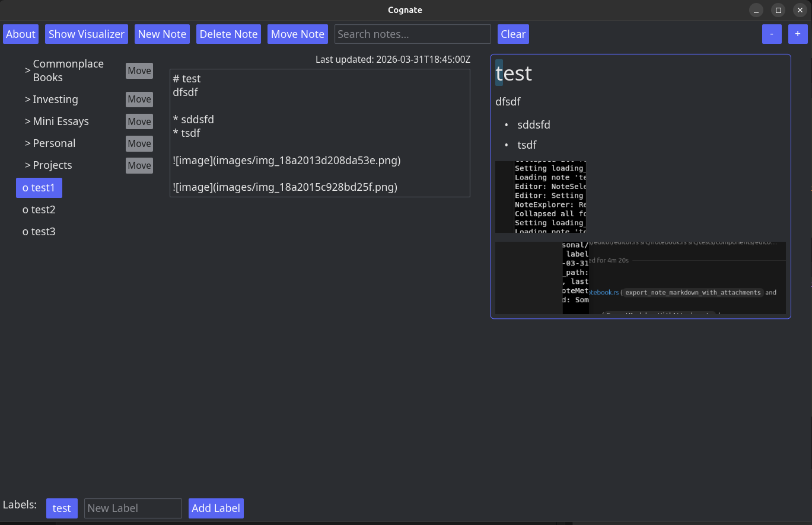
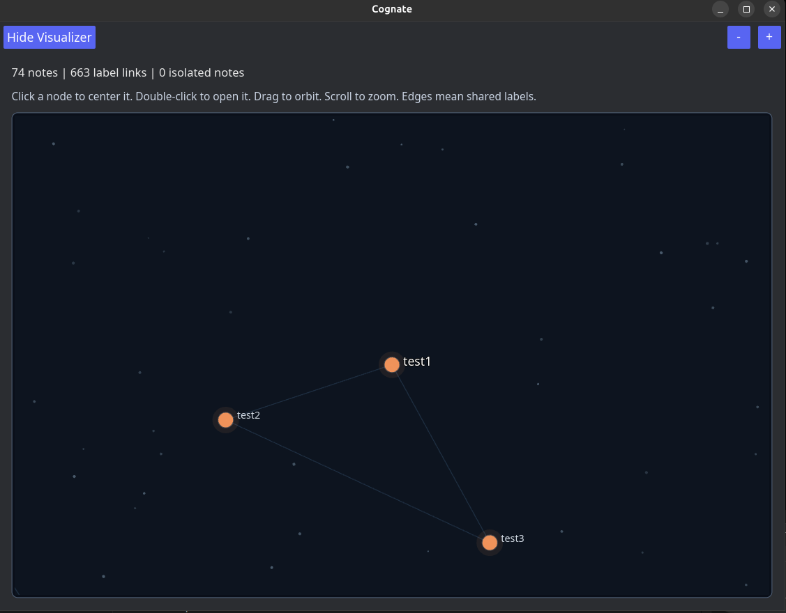

# Development Guide

This guide is the fastest way to onboard to Cognate as a contributor.

## Prerequisites

- Rust toolchain installed via `rustup`
- `cargo` available in `PATH`
- Optional: `make` for convenience targets

## Local Setup

1. Clone the repository.
2. Ensure `config.json` points to a valid notebook directory.
3. Run the app:

```bash
cargo run
```

## UI Snapshots





## Daily Commands

- `cargo test`: test the default desktop UI package
- `cargo test --workspace`: test all workspace packages
- `cargo test -p cognate`: test only the desktop UI package
- `cargo test -p cognate-engine --test notebook_tests --test search_tests -- --test-threads=1`: run transaction, recovery, filesystem, and search consistency tests
- `cargo clippy --all-targets -- -D warnings`: lint the default package
- `cargo clippy --workspace --all-targets -- -D warnings`: lint every workspace package
- `cargo fmt --all -- --check`: verify formatting
- `cargo run`: run the desktop app from the repository root
- `cargo run -p cognate`: explicitly run the desktop package
- `cargo run --release`: run the optimized desktop build

The CI workflow runs formatting, clippy, build, and tests. Keeping these green locally avoids CI churn.

## Module Orientation

- `cognate-ui/src/main.rs`: app startup and Iced wiring
- `cognate-ui/src/components/editor`: main editor update loop and UI composition
- `cognate-ui/src/components/editor/core/preview.rs`: preview facade; cursor mapping and markdown transformation live in `core/preview/`
- `cognate-ui/src/components/editor/actions/note_actions.rs`: action facade; navigation, creation, deletion, and move handlers live in sibling modules
- `cognate-ui/src/components/editor/lifecycle.rs`: editor construction, application entry points, view, keyboard/window subscriptions, and scale accessors
- `cognate-ui/src/components/visualizer/core/canvas_impl.rs`: canvas event/rendering facade; projection and hit testing live in `core/canvas_impl/projection.rs`
- `cognate-ui/src/components/note_explorer`: notebook tree and selection UX
- `cognate-ui/src/components/visualizer`: label graph rendering
- `cognate-ui/src/notebook`: backend facade, `api_client.rs` HTTP/error helpers, embedded API lifecycle, offline queue, and UI-facing notebook types
- `cognate-ui/src/notebook/offline_replay.rs`: queued-write replay, backoff, and conflict handoff
- `cognate-api/src/routes`: domain-specific attachment and search handlers composed by the API router
- `cognate-api/tests/*_route_tests.rs`: focused note, metadata, attachment, and two-client concurrency integration coverage
- `cognate-engine/src/storage/metadata.rs`: shared metadata types and timestamp normalization
- `cognate-engine/src/search/matching.rs`: snippets and highlight-range calculation
- `cognate-engine/src/search/cache.rs`: in-memory note content cache and cache path mutations
- `cognate-engine/src/search/maintenance.rs`: external filesystem refresh and persisted search-index synchronization
- `cognate-engine/tests/notebook_tests.rs`: core notebook lifecycle, metadata, and concurrency coverage
- `cognate-engine/tests/notebook_edge_case_tests.rs`: focused validation, recovery, and filesystem edge cases
- `cognate-ui/src/configuration`: config reader and theme conversion

See [ARCHITECTURE.md](ARCHITECTURE.md) for deeper boundaries and data flow.

## Testing Strategy

Automated coverage focuses on:

- Notebook operations and metadata persistence
- Editor state transitions and message flows
- Search behavior and cache eviction logic
- Configuration parsing and validation

Manual GUI checks are still important for interaction quality. Use [MANUAL_TESTING.md](MANUAL_TESTING.md).

## Generating Rust Docs

Use this when exploring module docs and public APIs:

```bash
cargo doc --no-deps
```
